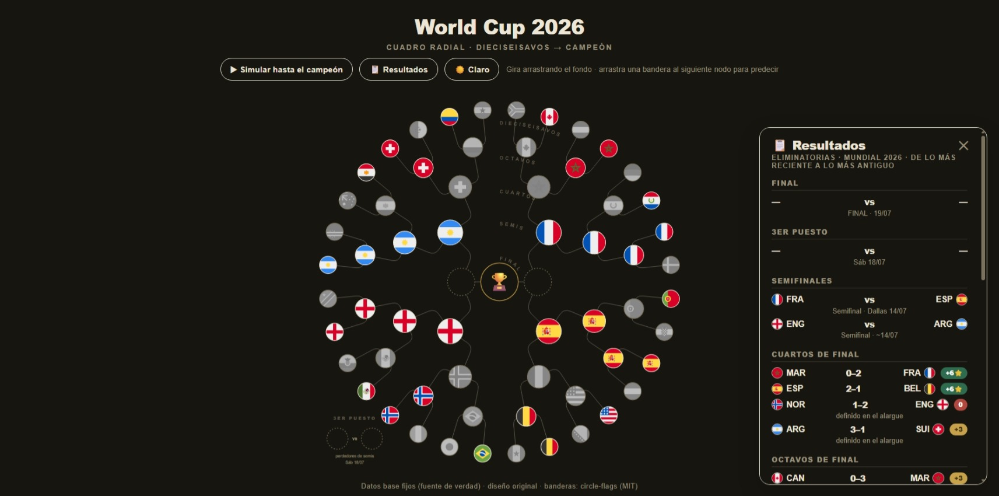

# 🏆 World Cup 2026 — Cuadro Radial Interactivo

Una visualización **radial e interactiva** del cuadro de eliminatorias...

Una visualización **radial e interactiva** del cuadro de eliminatorias del Mundial 2026, construida con HTML, CSS, JavaScript y SVG puros — **sin frameworks ni build**. Un solo archivo `index.html`, listo para hostear en cualquier lado.

> Los 32 equipos del knockout convergen desde el anillo exterior hacia el trofeo del centro. Cada resultado real hace que el ganador se **deslice** con animación hacia la siguiente ronda.

**[🔗 Demo en vivo](https://javierdotdev.github.io/world-cup-2026-bracket)**

---

## ✨ Características

- **Cuadro radial 360°** — de dieciseisavos al campeón, con líneas de esquinas redondeadas y **banderas que crecen de ronda en ronda** hacia el trofeo (crescendo visual).
- **Animación de avance** — al cargar, los clasificados se deslizan a su ronda real.
- **Ficha por equipo** — toca una bandera y abre un panel con:
  - Nivel, tipo de favorito y riesgo (perfil estratégico)
  - Partidos ganados en el Mundial (grupos + eliminatoria, sin contar penales)
  - Marcador del partido, alargue/penales y **el pick de la quiniela** con sus puntos
  - Próximo rival y fecha
- **Ruta iluminada** — resalta el camino de un equipo hacia el título.
- **Predicciones temporales** — arrastra una bandera a su siguiente nodo para predecir; se guardan en tu navegador y **nunca alteran los datos reales**.
- **Girar y hacer zoom** — arrastra el fondo para rotar la rueda; las banderas y el trofeo se mantienen derechos.
- **Panel de resultados 📋** — todos los partidos con marcador, penales/alargue, el pick de cada uno y el total de puntos de la quiniela, ordenados **de lo más reciente a lo más antiguo**.
- **3er puesto** — mini-cruce dedicado para los perdedores de semis, con ficha, pick, medalla 🥉 al ganador y **predicción del bronce** arrastrando al slot de medalla.
- **Simulación hasta el podio** — un botón simula el resto del torneo sin tocar los datos reales; lo hipotético se dibuja con **anillo punteado**, genera **marcadores simulados** (visibles también en la tabla) y *Estado real* lo revierte.
- **Podio visual 🏆🥈🥉** — copa junto al campeón, plata al subcampeón (que **conserva su color**: solo lo eliminado queda en gris) y medalla de bronce en su rincón.
- **Modo oscuro** — toggle 🌙/☀️ con preferencia guardada en el navegador.
- **Banderas con doble fuente** — CDN (circle-flags) con copia incrustada de respaldo: funciona hasta sin internet.
- **UX de foco** — al tocar un equipo, la rueda rota sola para dejar su rama visible; la ficha es panel lateral en escritorio y hoja compacta en móvil.
- **Responsive y multiplataforma** — probado en Android, iOS/Safari (filtros SVG nativos), escritorio y móvil.

---

## 🕹️ Cómo usar

- **Gira** arrastrando el fondo · **zoom** con la rueda o pellizco.
- **Toca una bandera** para abrir su ficha (perfil, partido, pick, próximo rival).
- **Arrastra una bandera** a su siguiente nodo para registrar tu predicción (borde dorado punteado). Arrástrala fuera para quitarla, o usa *✕ Limpiar predicciones*.
- **▶ Simular hasta el campeón** juega hipotéticamente lo que falta (podio incluido) · **📋 Resultados** lista todos los marcadores · **🌙/☀️** cambia el tema.
- Los botones **✕ Limpiar predicciones** y **↺ Estado real** son contextuales: aparecen solo cuando tienen algo que hacer.
- En el rincón del **3er puesto**, arrastra tu candidato al slot 🥉 para predecir el bronce.

---

## 🚀 Cómo publicarlo

Es un único archivo estático. Elige una:

**Opción A — Netlify Drop (la más rápida)**
1. Entra a [app.netlify.com/drop](https://app.netlify.com/drop)
2. Arrastra `index.html`
3. Listo: URL pública al instante.

**Opción B — GitHub Pages**
1. Crea un repositorio y sube `index.html`.
2. *Settings › Pages › Source:* rama `main`, carpeta `/root`.
3. Queda en `https://javierdotdev.github.io/world-cup-2026-bracket`.

No requiere Node, npm ni compilación.

---

## 🎯 El método detrás de los picks

Este cuadro nació de una quiniela real de 80 jugadores donde el reto era competir **sin seguir fútbol**, solo con análisis de datos. Cada pick sale de un marco propio:

- **3 tipos de favorito** — vs rival débil/abierto → goleada; vs muro defensivo → victoria corta; vs rival fuerte → resultado ajustado o empate.
- **Capa de gap** — primero se decide el *signo* (gana/empata/pierde), luego el margen.
- **Disciplina** — las lecturas en frío no se cambian por corazonadas de último minuto.

Las fichas muestran cada predicción y sus puntos, así que el cuadro es también el registro visual del método.

---

## 🛠️ Cómo está hecho / cómo editarlo

Todo vive en `index.html`. Los datos son objetos JavaScript al inicio del `<script>`:

- `TEAMS` — los 32 equipos en orden (cada par forma un partido; cada dos partidos, un cruce de la ronda siguiente).
- `MATCHES` — resultados reales por clave `"ronda-partido"`: marcador, quién avanza, penales/alargue, pick y puntos.
- `PROFILES` — perfil estratégico de cada equipo.
- `GROUPWINS` — victorias en fase de grupos.

Para cargar un resultado nuevo, agrega una línea a `MATCHES` (ej. `"2-0": {score:[1,0], adv:"ma", pick:[1,1], pts:3}`) y el ganador se anima solo a la siguiente ronda. El partido por el 3er puesto usa la clave especial `"3P"` (los participantes se derivan solos de los perdedores de semis).

> **Nota:** el `index.html` publicado incluye un script de analytics ligero y sin cookies (GoatCounter) al final del archivo. Si reutilizas el template, cámbialo por tu propio código o elimínalo.

---

## 🧩 ¿Reutilizable como template?

Sí. Sirve para cualquier torneo de eliminación directa (fútbol local, esports, torneos de empresa). Basta cambiar `TEAMS`, `MATCHES` y los perfiles. Para adaptarlo a otro número de equipos hay que ajustar los radios de los anillos en `RADII`.

---

## 🗺️ Roadmap (v2)

La siguiente evolución: el **torneo completo de 48 equipos** en un solo gráfico — un cinturón exterior de 12 grupos cuyas mini-tablas se actualizan por jornada, y cuyos clasificados se deslizan al anillo de dieciseisavos al cerrar la fase. Los mockups del concepto están en [`docs/`](docs/).

---

## 📄 Licencia

© 2026 Javier Martínez ([@javierdotdev](https://github.com/javierdotdev)).

Licencia **MIT** — libre de usar, modificar y compartir, conservando este aviso de copyright. Si lo reutilizas, un crédito se agradece. 🙌

---

*Hecho con curiosidad, datos y un poco de terquedad disciplinada.*
